## CS 5010 Project

#### Group: Knights Who Say Ni

#### Contributors
* Aman Srivastava (as3ek)
* Arnab Sarkar (as3uj)
* Kanika Dawar (kd2hr)
* Niharika Reddy (nb7ug)
* Varshini Sriram (vs4vx)

<div style="page-break-after: always;"></div>


## Introduction

<p align='justify'>The project has its foundation in our love for sports and years of playing FIFA. The website https://sofifa.com has extensive data about player statistics which was scraped for our analysis.

Insights and correlations between player value, wage, age, special attributes, and performance were derived from the dataset. This uninterpreted data was converted into information by drawing summary statistics for the teams, clubs, & players. Through extensive football experience: the insights provided in our results, along with understanding, and contextualized information enables users to act smartly when playing FIFA, picking a better team for the Fantasy Premier league, or increase their betting odds.
</p>

### Explorations Achieved using the data
* Summary statistics of all numeric attributes
* Grouping top players by Nationality
* Correlation of Value & Wages of players with age
* Correlation of Value of players with position
* Correlation of Overall & Potential with age
* Variation of overall & potential by country for top countries
* Correlation matrix - Performance attributes with overall rating
* Variation in wages for top clubs
* Age vs overall grouped by field position
* Forming a "dream team" given a number of user inputs
* Predicting playing position using player statistics

<div style="page-break-after: always;"></div>

## The Data
### Data Description

<p align='justify'>The data was scraped from the sofifa website using a python crawling script. The website contains the data from the EA Sports' game FIFA and gets updated regularly with the release of new versions of the game. We used the data developed by Electronic Arts for the latest edition of their FIFA game franchise. Through several research projects done on soccer analytics, it has been established in the field of academia that the use of data from the FIFA franchise has several merits that traditional datasets based on historical data do not offer. Since 1995, the FIFA Soccer games provide an extensive and coherent scout of players worldwide.</p>

<p align='justify'>For each attribute, we have an integer rating from 0 to 100 that measures how good a player is at that attribute. Examples of attributes are: dribbling, aggression, vision, marking and ball control. Observe that it seems to be unfeasible to accurately characterize players in these attributes automatically. Thus, all of those are gathered and curated by the company whose job is to bring the gameplay closer to reality as possible, hence preserving coherence and representativeness across the dataset.</p>

<p align='justify'>The FIFA 18 dataset that has been used for this analysis provides statistics of about 16000 players on over 70 different attributes. These attributes are optimal indicators to determine the performance of a player at a particular playing position.</p>

<div style="page-break-after: always;"></div>

### Data Collection
<p align='justify'>After extensively studying the structure of the website, the crawler was designed to scrape the website in two steps. The first step was to scrape the main page of the webpage which contains basic player information in a table. Apart from extracting the basic player information, the crawler extracted the url of the player's detailed statistics page.</p>

<p align='justify'>The table on the webpage had entries for 80 players on each page and the url of the page took offset for player id as a query parameter. The scraper managed to algorithmically generate the urls of all the pages on website by manipulating the offset query in the url and iteratively visited all the pages to extract the details.</p>

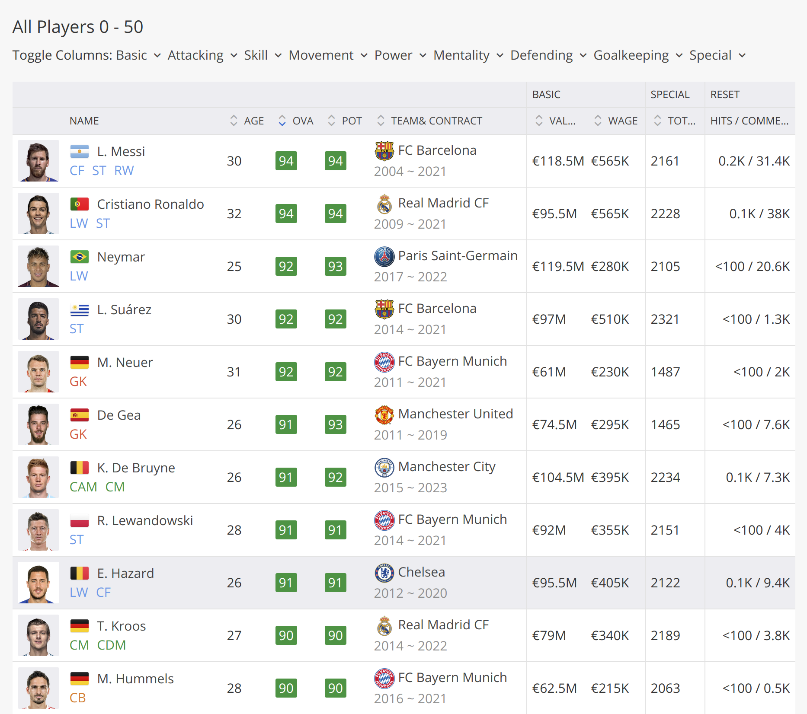

<div style="page-break-after: always;"></div>

<p align='justify'>The next step was to use the collected urls for individual players to scrape data from their details page. This page contains skill statistics, team affiliations and performance statistics for the player.</p>

<br>


<br>

<div style="page-break-after: always;"></div>

### Content

The scraped dataset has the following properties:

* Every player featuring in FIFA 18
* 70+ attributes
* Player and Flag Images
* Playing Position Data
* Attributes based on actual data of the latest EA's FIFA 18 game
* Attributes include all player style statistics like Dribbling, Aggression, GK Skills etc.
* Player personal data like Nationality, Photo, Club, Age, Wage, Salary etc.

```python
data.columns
Index(['ID', 'Photo', 'Name', 'Age', 'Nationality', 'Flag', 'Overall',
       'Potential', 'Club', 'Club Logo', 'Value', 'Wage', 'Special',
       'Acceleration', 'Aggression', 'Agility', 'Balance', 'Ball control',
       'Composure', 'Crossing', 'Curve', 'Dribbling', 'Finishing',
       'Free kick accuracy', 'GK diving', 'GK handling', 'GK kicking',
       'GK positioning', 'GK reflexes', 'Heading accuracy', 'Interceptions',
       'Jumping', 'Long passing', 'Long shots', 'Marking', 'Penalties',
       'Positioning', 'Reactions', 'Short passing', 'Shot power',
       'Sliding tackle', 'Sprint speed', 'Stamina', 'Standing tackle',
       'Strength', 'Vision', 'Volleys', 'CAM', 'CB', 'CDM', 'CF', 'CM', 'LAM',
       'LB', 'LCB', 'LCM', 'LDM', 'LF', 'LM', 'LS', 'LW', 'LWB',
       'Preferred Positions', 'RAM', 'RB', 'RCB', 'RCM', 'RDM', 'RF', 'RM',
       'RS', 'RW', 'RWB', 'ST'], dtype='object')
```

### Data Cleaning and Manipulation

<p align='justify'>As the data was scraped from a website it had several inconsistencies and properties that made it unfit for appropriate exploratory analysis. In order to prepare the data, the following steps were performed: </p>

* The Wage and Value of all the players were in form of strings with the symbol of the currency in front of the values - `€190K`. These were converted to numeric values.
* The preferred positions of all the players was available as a space separated string (`ST LW`) which was converted to a list for easier retrieval.
* A new attribute `FieldPosition` was created by mapping the preferred positions of all the players with their respective roles in the team, like attack, midfielder, defense or goalkeeper.
* Using the nationality of the players, a new attribute was created that contained the continent the player belonged to.

## Exploratory Data Analysis

<p align='justify'>After preparing the dataset for analysis, macro-level explorations were made for example, continent and player nationality level analysis as well as player level analysis. Through this process, attempts were made to derive interesting correlations and trends by the use of visualizations.</p>

### Geographic distribution of top players
<p align='justify'>Circle-packing is the arrangement of circles inside some demarcation so that none of the circles overlap. Circle packing also displays hierarchy where you can get smaller clusters of circles packed within a bigger circle which itself is arranged next to or within other circles. The D3.js plot will be interactive and dynamic, where one is able to invoke zoomable animations at different regions and clusters with the click of a mouse button.
 Each of the player’s nationality was mapped to its respective continent. There were 162 distinct Nationality values in the dataset and these countries were mapped to 6 continents: Asia, Europe, Africa, North America, South America and Australia/Oceania. In the plot, the 6 continents are the parent class (outer circles). We can dive deeper within this class to find the countries (sub-class / sub-circles) and within each country, we will find the players (inner circles). The size of the player circle is determined by the Overall variable. A continent dictionary was created with the names of the continents as the keys and the list of countries as the values for each key. A function was defined to assign the continent for each country. The top 2000 players were chosen based on the overall value. Groupings of the players were hence identified using the Nationality and Continent. This grouping was displayed with the circle graph plot and fed into the json file. The data to be displayed was stored in the json file.
</p>


<p align='justify'>This plot clearly shows the concentration of players across the continents. The size of the circles determines the number of top players in each region. Most of the top players are concentrated in Europe and South America. These two circles are significantly bigger than the other circles. Africa, Asia and North America have only few top players compared to Europe and South America though they are bigger in terms of size. This is clearly seen from the size of the circles. In Europe, Spain, Germany, France, Italy and Portugal have a very good number of top players. For South America, it is Brazil and Argentina.  The distribution of top players across regions is useful in predicting the best team according to Nationality.</p>

<div style="page-break-after: always;"></div>

### Nationality wise analysis

<p align='justify'>This section explores aggregate statistics of players hailing from all major football playing nations. Country wise mean, maximum and minimum values were identified for all the numeric attributes and plotted on an interactive world map.</p>


<p align='justify'>The above plot demonstrates that South American, African and European players are generally rated higher than their counterparts from Asia, Australia or North America. While the nationwide average rating for USA stands at 65.81 and 58.06 for India it is about 71.24 for Brazil and 69.11 for China. Similarly, patterns were observed for other attributes as well.</p>

<div style="page-break-after: always;"></div>

### Correlation between player attributes and overall rating

<p align='justify'>Speaking of player attributes, there are 35 skills across which all the players have been rated. These ratings contribute to the player’s overall rating and potential. An effort was made to understand which skills are highly correlated with the overall rating of players. To help perform and visualize the analysis, a correlation matrix was plotted and displayed as a heatmap. The heatmap, which its color-coded scale of correlation coefficient gives a quick overview of which skills are highly correlated and which are negatively correlated. The darker the color of the square, the more is the correlation.</p>

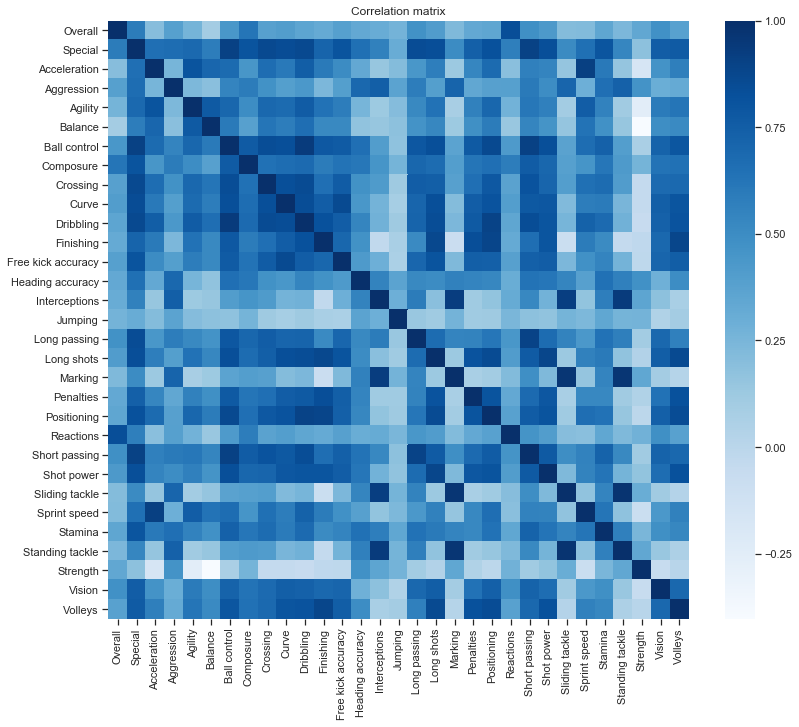

<p align='justify'>To deduce which are the skills correlated with the overall, we chose a correlation coefficient greater than or equal to 0.5. Anything between 0.3 and 0.5 is attributed to being moderately correlated.</p>


### Countries with the best aggregate player ratings

<p align='justify'>To explore which teams have the potential to surpass the current best, the following analysis was done. The top 10 countries by number of players were chosen and the overall and potential of their players were depicted as box plots.</p>


Overall Rating             |  Potential Rating
:-------------------------:|:-------------------------:
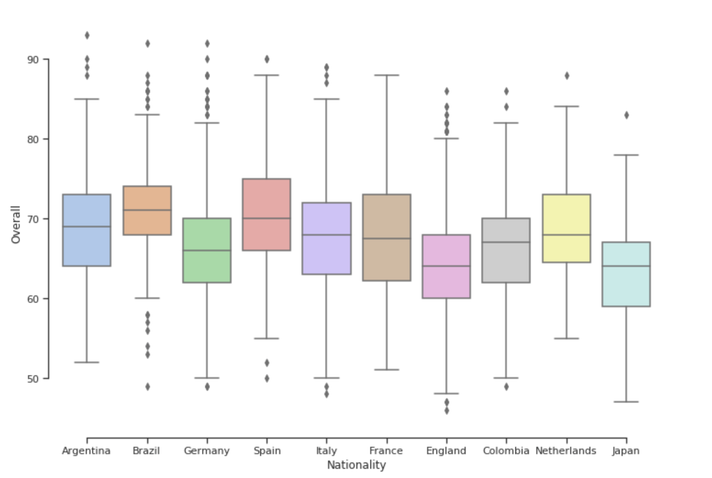  | 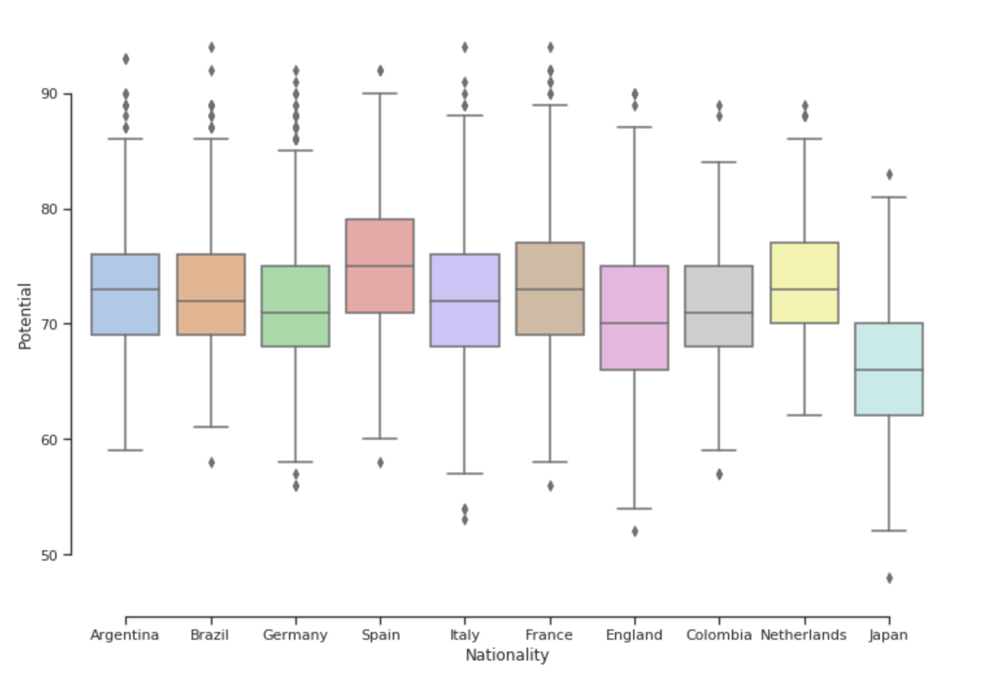


<p align='justify'>The mean overall is seen to be highest for Brazil followed by Spain, Argentina, Netherlands and France. However, in terms of potential, Spain seems to have overtaken Brazil, followed by Netherlands and France.
This gives an indication about which teams are likely to perform better in the coming few years. Further ways in which this analysis can be improved is by plotting box plots against the highly and moderately correlated attributes that we saw above to reveal which are the attributes a country’s players are focusing on and make changes in their strategy if deemed fit.</p>

### Clubs with the best aggregate player ratings

<p align='justify'>The aggregate overall and potential rating were compared amongst top 10 football clubs. These clubs were identified to have the best overall rating aggregate.</p>


Club          |  Median Rating
:-------------------------:|:-------------------------:
	Real Madrid CF | 83.0
	Juventus |	83.0
	FC Bayern Munich |	82.5
	FC Barcelona |	82.0
	Manchester City |	81.5
	Paris Saint-Germain |	81.0
	Chelsea |	80.5
	Atlético Madrid|	80.0
	Manchester United|	79.5
	Arsenal |	79.5


<p align='justify'>The variation of overall rating and potential rating was then demonstrated for these clubs using boxplots. This gives an indication about which clubs are likely to perform better in the coming few years. Further ways in which this analysis can be improved is by plotting box plots against the highly and moderately correlated attributes that we saw above to reveal which are the attributes a club’s players are focusing on and make changes in their strategy if deemed fit.</p>


Overall Rating             |  Potential Rating
:-------------------------:|:-------------------------:
  | 

<p align='justify'>The mean overall is seen to be highest for Real Madrid followed by Juventus, FC Bayern Munich, FC Barcelona and Manchester City. However, in terms of potential, FC Barcelona seems to have overtaken Real Madrid, indicating a presence of a lot of young talent at the club.</p>

<div style="page-break-after: always;"></div>

### Player earnings at top clubs

<p align='justify'>A quick way to understand which clubs command the highest salaries is to plot the wages as a box-plot. This gives all the important statistical metrics as well as the spread about the mean. To do this analysis, the top 10 clubs by median overall rating were chosen and their wages depicted as box plots.</p>

By Wage             |  By Player Value
:-------------------------:|:-------------------------:
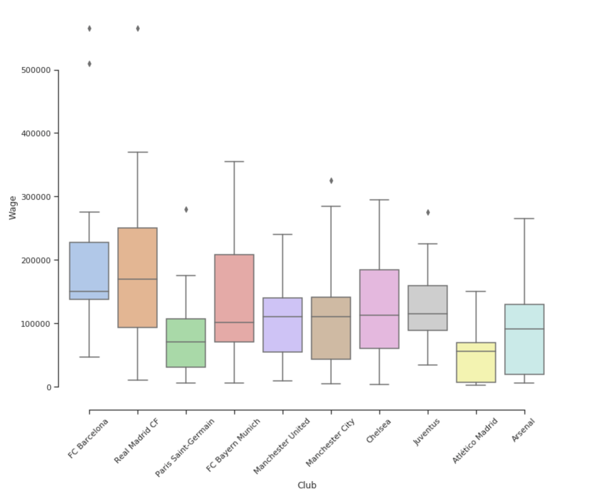  | 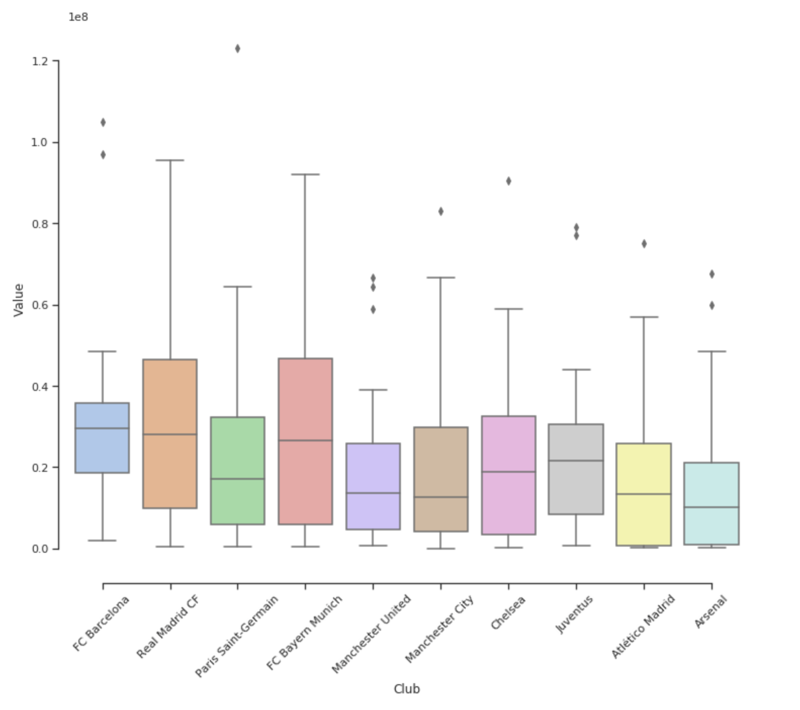

<p align='justify'>Real Madrid is seen to have the highest wage in terms of mean wage, followed by FC Barcelona and Manchester United and Manchester City. A real world application of this analysis can be used by players to decide which club they should strive for if they want a wage hike. Also in terms of most valuable players, Real Madrid and FC Bayern Munich seem to lead the pack. </p>

### Player rating variation with age

<p align='justify'>All players have been rated according to their overall performance as well as their potential rating in the future. On basic visual analysis of the data, it was noticed that a few of the older players had already reached their potential rating. To further delve into this and find an age where overall met the potential, the data was grouped by age and at each age, the average overall and average potential were calculated. These values were plotted as a line graph against the age as the line graph would show a clear trend of changes in these ratings and also if the overall and potential ratings met at a certain age. </p>

<div style="text-align:center">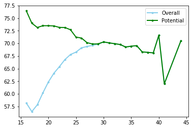</div>

<p align='justify'>As we can see from the above graph, we notice that overall and potential meet approximately at around age 29 and continue to match as the age goes up. Another interesting trend that was observed was that, while overall rating increased as age increased and peaked between the years 29 to 33, the potential rating actually decreased as age progressed till it met the overall and then plateaued. There are very few players above the age of 37 and have been ignored as outliers.
This analysis can be useful while creating a squad as the age can be used as a factor in deciding whether a player should be retained or dropped. A way that this can be further enhanced is to find the trend of each player attribute across ages to determine the age at which each player attribute peaks.</p>

### Analysis of Mean Player Value versus Age

<p align='justify'>Here analyzed the mean player value across ages 18 to 36, for the top 1000 players ranked as per their overall potential. We used a bar chart along with a line chart here to display the data, with the ages on the x-axis and the average player value (in millions of Euros) on the y-axis. The observations from this chart can be used by both new players as well association football management to get an idea of current player valuation trends with respect to players at different
ages.</p>

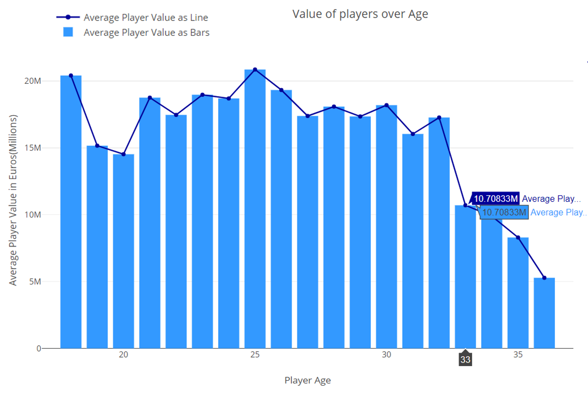

<p align='justify'>
From this chart, we can see that are two peaks for player value – One right at age 18(20.4 M Euros), and the other at age 25(20.8 M Euros). This seems to indicate that young players at 18 years of age tend to be traded at high values across clubs due to their sheer potential. After 18, there appears to be a sharp drop at age 19. Average player value rises from age 19 onwards to peak at 25, following which there is gradual decline till age 32. Player value sharply falls after that, most likely due to the fact that older players in their mid-late 30s are considered to have spent their potential by then and have less resale value among clubs, in spite of the fact that they are more experienced.
Next we focused on the distribution of player value against age as opposed to the previous plot of average values. For this, we used violin plots, with box plot within. The violin plot is more informative than a simple box plot here because not only does it convey the distribution of the Player Value at each age (through Min,Q1,Median,Q3,Max) but it also shows the kernel density i.e. how common each player value point is by the width of its shape.  
</p>

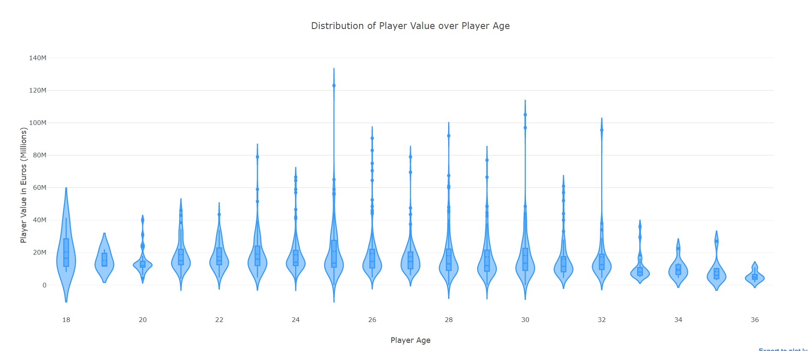

<p align='justify'>The observations here are that most players (between Q1 and Q3) across all ages have nearly equal violin width. It’s the high performing players who are outliers and pulling up average values at each age. One departure however is again at the age 18, where from the shape of the violin we can make out that 18 year old players are evenly distributed in the range 8-36 Million. Thus players debuting at age 18 have a great chance of being valued highly. Also, from the distribution, it is apparent that player valuation decreases post 32 for nearly all players, as apparent from the violin density. </p>

<div style="page-break-after: always;"></div>

### Analysis of Player Weekly wage over Age

<p align='justify'>We used box plots and line plots to show the average weekly wage of players (y-axis) versus the age of players (x-axis). We have only considered the top 1000 players aged between 18 and 36. Like the valuation data, observations from this plot can be used by new players and association football management to get an idea of current player wages for different age groups.</p>

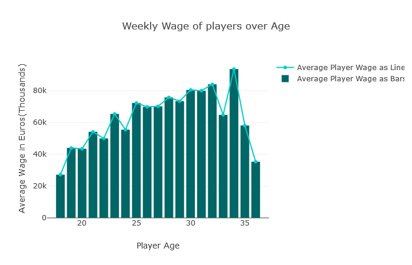

<p align='justify'>Unlike with Player Value, Average Player weekly Wage is at its lowest(27K Euros) at 18 years age and then steadily rises till peaking(93.6K Euros) at age 34, and then from there it starts to fall. This trend shows us that while Player Value was more dependent on the potential of the player, player wages are more affected by the experience of the player and their seniority in teams. The increase in player weekly wage is also much more gradual with age as compared to player value, which was prone to much variation. One anomaly is the sharp dip in average weekly wage at age 33 as compared to ages 32 and 34. This can be attributed to the fact that there may not be many players currently in the top 1000 who are of age 33, and the ones who are there seem to have lower weekly wage values.</p>

<p align='justify'>In the next plot we focussed on the distribution of the weekly wage values versus age using violin plots (with box plots inset inside them). Again we used the violin plot here as it offered much more information in terms of showing the proportion of the player population at a particular value of weekly wage for a particular age group.</p>

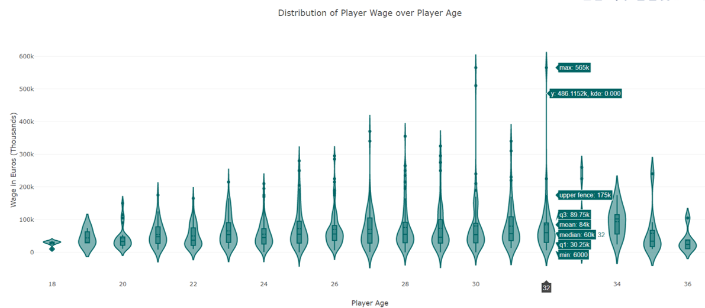

<p align='justify'>Here we observe that almost across all ages the weekly wage is uniformly distributed in the 25k-75k range as apparent from the distribution of density kernel shape. The average weekly wage however shoots up due to extremely well paid players in each group, which are visible as outlying points in the plot. From ages 25-32, we can also see that there is a large distribution of players who earn more than 100K euros a week. Not surprisingly, almost all 18 year old players are clustered around the same starting weekly wage value, almost all distribution across the density kernel width is at around 30K. Players at age 34 seem to have the most uniform distribution of weekly wage, with nearly 75% in the middle have weekly wages in the range 60K to 115K. </p>

<div style="page-break-after: always;"></div>

### Analysis of Player Value distribution with position

<p align='justify'>Here we attempt to show the distribution of player value at different positions. We have associated each player to their preferred position or where they are most likely to play (available in the data as an array of preferred positions for each player). We are making use of box plots with whiskers as well outliers to show the distribution of player value across all popularly played positions in football. Observations from the box plot can help new players and managers get an idea of current player valuation trends at each position.</p>

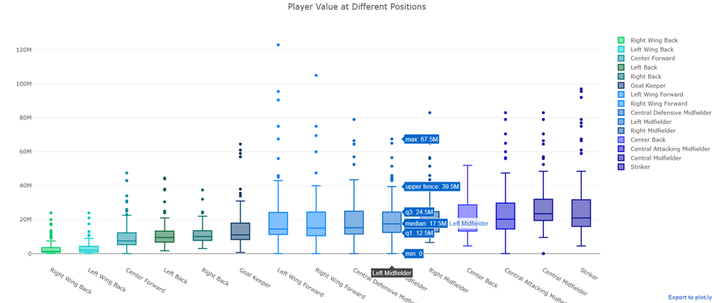

<p align='justify'> From plotting the data one can see there are clear divisions in player valuation across player positions. For the purpose of comparison, we are only using the top 100 players in each position. The group with least valuation is of the two wing backs (right and left) having a median valuation of just 1.4-2.1M Euros. This is followed by a group consisting of 4 positions with nearly same valuations – Center Forward, Left Back, Right Back and the Goalkeeper. Surprisingly Center forward which used to be a traditional forward role seems to be eclipsed by roles such as Strikers and Central Attacking Midfielders. The median valuation for Center forwards is 7.5M. Left and Right back defenders have median values of 9.5-10M Euros and Goalkeepers round off this group with median player value of 11M. However there are a lot of goalkeeper outliers who have value of as much as around 60M. </p>

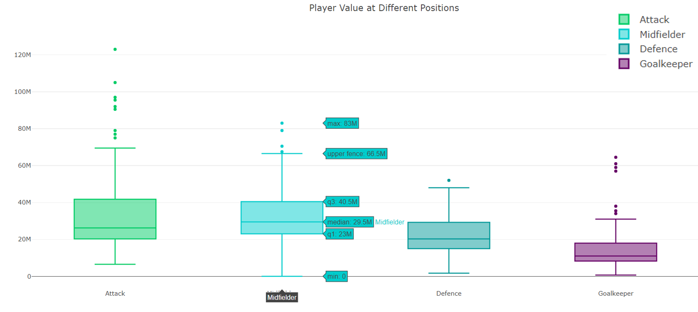

<p align='justify'>The next group consists of the Left and Right wing forwards, Central Defensive midfielder, and the left and right midfielders. All these positions have a player value median in the range of 14.5M to 18.5M.  Though players between Q1 and Q3 are almost evenly distributed across these groups, it’s the outliers here which are most distinctive. Neymar with a valuation of 123M is a distinct left forward outliers. Others include Lionel Messi at 105M as well as Christiano Ronaldo at 95.5M as right forwards. The next and most valued group consists of the Center Back, the Central Attacking Midfielder, Central Midfielder and finally the Striker. The median value varies from 19 to 23.5M for this group, with both midfielder and the striker positions having many high value outliers like Luis Suarez who as a striker is valued at 97M Euros.</p>

### Top players by playing position
<p align='justify'>In the FIFA 18 dataset, there is a score for each player for every possible position on the field. Some players are more versatile, and have good rankings for multiple positions as well. We have tried to get the top 10 players by their position score  (not overall/potential) to make an informed choice of which player to pick for which position.
The most appropriate way to show any data with only categorical (explanatory) variables, is not as a graph but a table. Hence, we have chosen a simple tabular representation where the rankings of the 10 players (in decreasing order of their potential to score) for each position has been shown.</p>

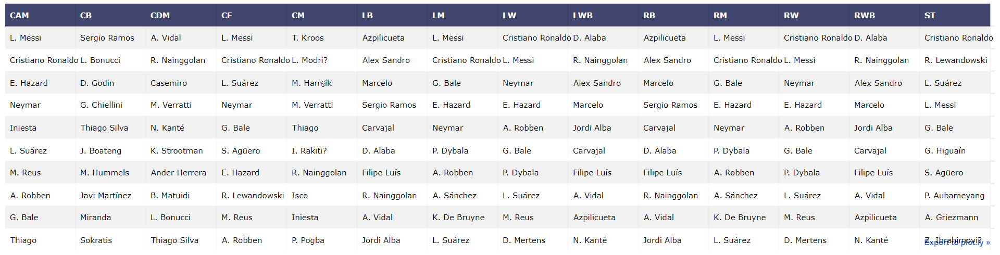

<p align='justify'>L. Messi and C. Ronaldo seem to be the most consistent players of the lot having top rankings at over 3 positions. Some players have top rankings in a single position category making them the best but don’t appear anywhere in other categories like T.Kroos. As a general trend, it is noticed that top players of each position play consistently across Center, left, and right positions of the same category.

This can be used to make smart & informed decisions about which player to pick for what position not just independently but relatively seeing rankings and consistency of choices across the board. This always gives a good idea of the success odds of a player when he is already playing at a certain position.</p>

### Are they really worth it?
<p align='justify'>Players have two monetary attributes to them – Wage and Value. There is a large variation between the numbers both in terms of scale, delta difference, and consistency. We wanted to find out if the most valuable players are actually worth their salaries. Also, we wanted to see if there is a common trend of players being valued higher in line with their potential. We chose to present this using a multi axis combination chart because of different axis scales for `Overall Score + Potential (on primary y axis)`, `Value (secondary y axis)`, `Wage (Secondary 2 y axis)`. Stacked bar for `Score` and `Potential` because `Potential >= Overall` score so this will give us an idea of players performing to maximum potential and otherwise.</p>

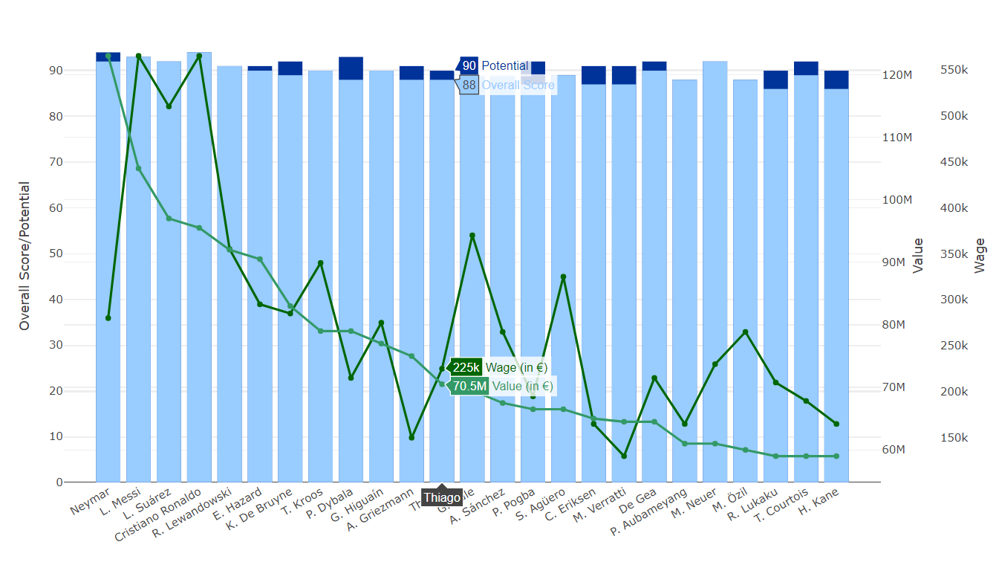

<p align='justify'>We found that Neymar – the player with the highest value  lies in the lower wage category of Top 25 most valued players whereas Sanchez and S. Aguero have wages in Top 5 despite being ranked in the lower side of most valued players. L. Messi, L. Suarez, and C. Ronaldo seem to be most consistent in both categories and have also performed to the best of their potential. P. Dybala and P. Pogba have the most difference between Potential and performance.</p>

<p align='justify'>We discovered that wages and values do not necessarily correlate with each other in a direct sense, the next step of further improvement would be to find out the factors that affect the value and wage and wages of a player and their corresponding significance (coefficients).</p>

## The Best Squad (User Interaction)

<p align='justify'>The aim in this section is to use statistical analysis on our data to find out the best squad for a dream team given a user selected formation, nationality and/or club. For every given playing formation the program computes the best players for each position in that formation and gives you the best possible player. </p>

<p align='justify'> The program takes the following 3 parameters as user inputs: </p>

> Formation (3-5-2, 4-4-2, 4-3-3, 3-4-3, 5-3-2)
> Nationality (and/or)
> Club

<p align='justify'>
The best team for 4-3-3 formation predicted by the program was:
</p>

<div align='center'>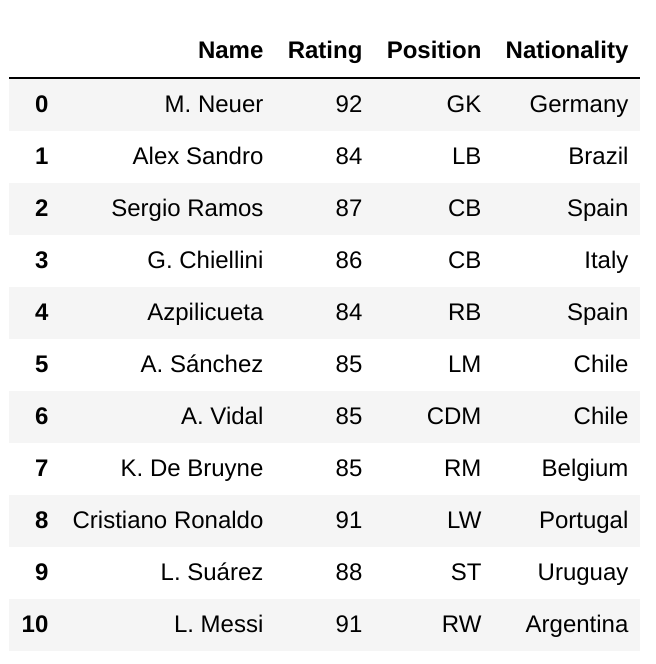</div>

<p align='justify'>
The best team for 3-5-2 formation for the country Brazil predicted by the program was:
</p>

<div align='center'>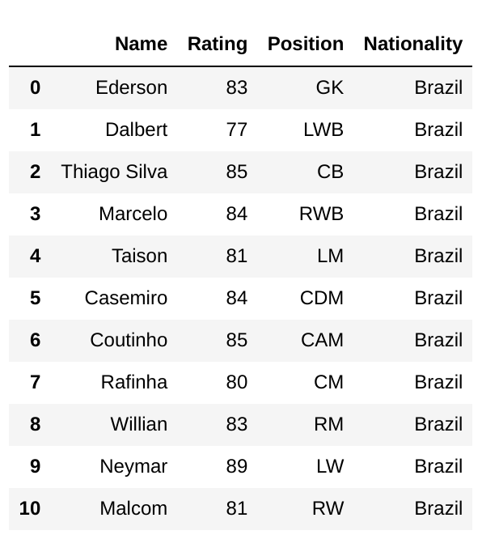</div>

## Predicting player position

<p align='justify'>The ultimate goal of our approach is to assign optimal position to the players depending on their skillset. In this case, three output classes are pre-decided: attack, mid and defense. Since there are many features that are not relevant to deduce our results, we can drop them. Thus, the selection of 30 relevant features is done for improving the accuracy of the model by supplying quality data to the classifier. For example, attributes like personal information are futile for training the classifier and thus can be ignored for analysis. The dataset has a column where the preferred position of the player is stated. A total of 14 positions are then mapped to the 3 pre-decided classes. </p>

The machine learning models used in this approach are Random Forests and Logistic Regression. In case of Logistic Regression, Multinomial Logistic Regression is used since the dependent classes is a multi-class. Random forests is used with default parameters.

The top 10 most important features for the prediction were :
```python
            Attributes                    Coef
0            Finishing     0.09187908935469322
1          Positioning     0.04294413649854606
2         Long passing    0.034394793890987395
3            Reactions     0.03356310980569168
4              Volleys     0.02922170807979512
5        Short passing    0.024554753581556697
6         Ball control    0.019851379649650565
7             Crossing     0.01869540014896692
8          GK reflexes    0.016953298324941423
9              Marking    0.016796213892711038
10        Sprint speed     0.01670935869115817
```


### Results

The resulting confusion matrices for both the models are:

<div align='center'></div>
<p align='center'>Logistic Regression</p>

<div align='center'> </div>
<p align='center'>Random Forest</p> The logistic regression model seems to have a better accuracy at predicting the positions of players and hence is our model of choice.

<div style="page-break-after: always;"></div>

## Unit Testing

<p align='justify'>Ten unit tests were written to test the five methods defined and used in the program.</p>

The methods used were:
* in_preferred_position:
>to check whether a position is there in a list of positions
A list of positions was defined and two unit tests were carried out on this function. The first test checked with a position present in the list. The function returned True. The second test checked for a position that was not present in the list. The function returned False.

* str2number: to convert a string to a number
>Two unit tests were written to check whether the wage(€565K') and value('€95.5M') variables were converted to numbers. The function returned 95500000.0 and 565000.0 respectively.

* convert_to_float: to convert values to float
>Two unit tests were written to check whether integers were converted to float type numbers using Attribute values like Agility and Balance. The function returned the values with decimal places.

* find_continent: to return the continent for each country
>Two unit tests were carried out to check if the right continent was returned for the country values.

* get_best_squad: to give the best squad of players given the formation and country/club
>Two unit tests were written to verify whether the function returns the squad correctly.
All the tests passed successfully.

<div style="page-break-after: always;"></div>

## BIBLIOGRAPHY

LIBRARIES

* numpy
* pandas
* plotly
* seaborn
* json
* matplotlib
* itertools
* sklearn
* IPython
* string
* re

WEBSITES

* https://stackoverflow.com/
* https://kaggle.com/
* https://seaborn.pydata.org/
* https://seaborn.pydata.org/examples/index.html
* https://wiki.python.org/moin/PythonGraphLibraries
* https://python-graph-gallery.com/
* https://github.com/
* https://plot.ly/python/
* https://pandas.pydata.org/
